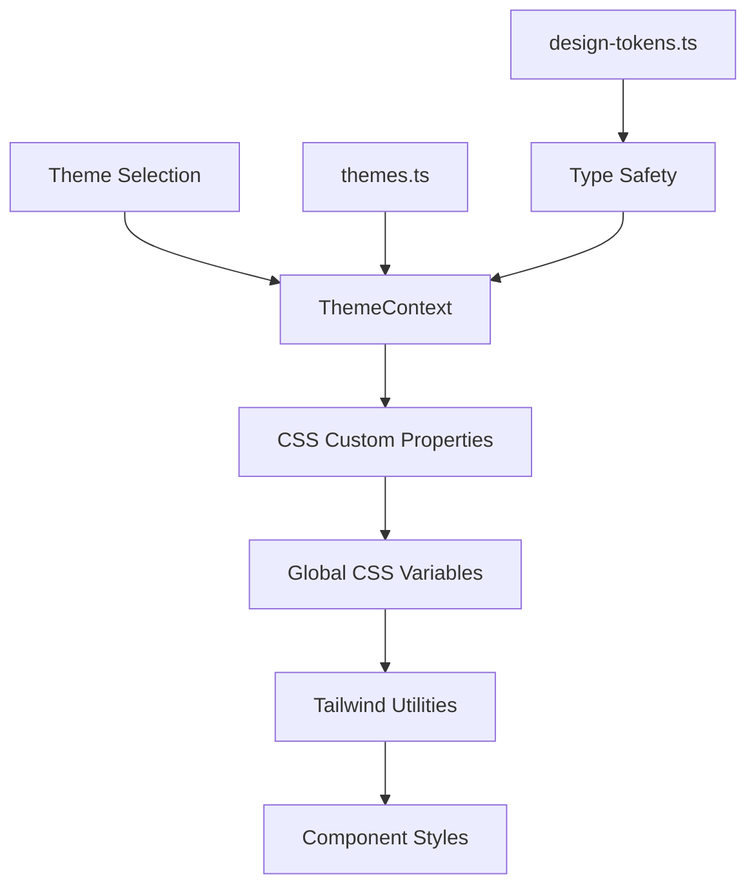

# Echo Theory Labs - Design System

> Comprehensive guide for developers working with the Echo Theory Labs design system, theme
> architecture, and styling patterns.

## 📋 Table of Contents

- [Overview](#overview)
- [Theme Architecture](#theme-architecture)
- [Design Tokens](#design-tokens)
- [Component Styling Patterns](#component-styling-patterns)
- [Theme Management](#theme-management)
- [Adding New Themes](#adding-new-themes)
- [Best Practices](#best-practices)
- [Common Patterns](#common-patterns)
- [Troubleshooting](#troubleshooting)

## 🎯 Overview

The Echo Theory Labs design system is built on a **theme-first architecture** that enables:

- **Scalable theming**: Easy addition of new themes without component changes
- **Consistent styling**: Centralized design tokens and semantic naming
- **Performance**: CSS custom properties with minimal runtime overhead
- **Developer experience**: Type-safe theme management with IntelliSense support

### Core Principles

1. **Theme-driven**: All styling decisions flow from theme definitions
2. **Semantic naming**: Use meaningful names like `text-primary` not `text-gray-900`
3. **Component agnostic**: Components don't know about specific theme values
4. **Global propagation**: Theme changes cascade from root to all components

## 🏗️ Theme Architecture

### File Structure

```
lib/
├── themes.ts              # Theme definitions with CSS custom properties
├── design-tokens.ts       # Semantic design token mappings
└── ThemeContext.tsx       # React context for theme management

app/
└── globals.css           # Global styles and CSS custom properties

tailwind.config.js        # Tailwind configuration with theme-aware utilities
```

### Theme Flow



## 🎨 Design Tokens

### Color System

Our color system uses **semantic naming** with HSL values for better manipulation:

[lib/themes.ts](../lib/themes.ts)

### Typography System

````typescript
[lib/design-tokens.ts](../lib/design-tokens.ts)

## 🧩 Component Styling Patterns

### ✅ DO: Use Semantic Classes

```tsx
// ✅ Good - Semantic and theme-aware
<div className="bg-background-primary text-text-primary border-border-primary">
  <h1 className="text-text-primary">Title</h1>
  <p className="text-text-secondary">Description</p>
</div>
````

### ❌ DON'T: Use Hard-coded Colors

```tsx
// ❌ Bad - Hard-coded and not theme-aware
<div className="bg-white text-black border-gray-300">
  <h1 className="text-gray-900">Title</h1>
  <p className="text-gray-600">Description</p>
</div>
```

### Theme-Aware Component Example

```tsx
// components/ExampleCard.tsx
export const ExampleCard = () => {
  return (
    <div className="bg-background-secondary border border-border-primary rounded-xl p-6">
      <h3 className="text-text-primary text-xl font-bold mb-2">
        Card Title
      </h3>
      <p className="text-text-secondary text-base leading-relaxed">
        This card automatically adapts to theme changes without any component modifications.
      </p>
      <button className="mt-4 bg-accent-primary text-white px-4 py-2 rounded-lg hover:bg-accent-secondary transition-colors">
        Action Button
      </button>
    </div>
  );
};
```

## 🎛️ Theme Management

### ThemeContext Usage

[lib/ThemeContext.tsx](../lib/ThemeContext.tsx)

### Theme Application Flow

1. **Theme Selection**: User selects theme via `setTheme('light' | 'dark')`
2. **Context Update**: `ThemeContext` updates state and localStorage
3. **CSS Variables**: Theme values applied to `document.documentElement.style`
4. **Class Application**: Theme class added to `<html>` element
5. **Global Propagation**: All components automatically receive new styles

```typescript
// ThemeContext applies theme like this:
useEffect(() => {
  const root = document.documentElement;
  const themeVars = themes[theme];

  // Apply CSS custom properties
  Object.entries(themeVars).forEach(([key, value]) => {
    root.style.setProperty(key, value);
  });

  // Apply theme class for Tailwind compatibility
  root.className = root.className.replace(/theme-\w+/g, '');
  root.classList.add(`theme-${theme}`);
}, [theme]);
```

## ➕ Adding New Themes

### Step 1: Define Theme in `themes.ts`

```typescript
// lib/themes.ts
export const themes = {
  light: { /* existing light theme */ },
  dark: { /* existing dark theme */ },
  // Add new theme
  ocean: {
    '--color-background-primary': '200 100% 5%',     // Deep ocean blue
    '--color-background-secondary': '200 100% 8%',   // Darker ocean
    '--color-background-tertiary': '200 100% 12%',   // Medium ocean
    '--color-text-primary': '200 100% 95%',          // Light blue-white
    '--color-text-secondary': '200 100% 75%',        // Medium blue
    '--color-text-muted': '200 100% 55%',            // Darker blue
    '--color-border-primary': '200 100% 20%',        // Ocean border
    '--color-border-secondary': '200 100% 25%',      // Lighter ocean border
    '--color-accent-primary': '180 100% 50%',        // Cyan accent
    '--color-accent-secondary': '160 100% 50%',      // Teal accent
    '--font-family-primary': 'Inter, sans-serif',
  },
} as const;

export type ThemeName = keyof typeof themes; // Automatically includes 'ocean'
```

### Step 2: Add Theme Toggle Option

Update the [components/ThemeToggle.tsx](../components/ThemeToggle.tsx)

```tsx
// components/ThemeToggle.tsx
export const ThemeToggle = () => {
  const { theme, setTheme } = useTheme();

  const themes = ['light', 'dark', 'ocean'] as const;

  // rest of the code
};
```

### Step 3: No Component Changes Required!

All existing components automatically support the new theme because they use semantic classes:

```tsx
// This component works with ALL themes without modification
<div className="bg-background-primary text-text-primary">
  Content automatically adapts to ocean theme!
</div>
```

## 📏 Best Practices

### ✅ DO's

1. **Use semantic naming**: `text-primary` not `text-gray-900`
2. **Leverage CSS custom properties**: All theme values are CSS variables
3. **Follow HSL format**: Better for color manipulation and accessibility
4. **Test all themes**: Ensure components work across all theme variations
5. **Use design tokens**: Import from `design-tokens.ts` for type safety
6. **Maintain consistency**: Use the same semantic names across all themes

### ❌ DON'Ts

1. **Don't hard-code colors**: Avoid `bg-white`, `text-black`, `border-gray-300`
2. **Don't modify components for themes**: Themes should be component-agnostic
3. **Don't use inline styles**: Use Tailwind classes with semantic names
4. **Don't skip accessibility**: Ensure proper contrast ratios in all themes
5. **Don't forget font families**: Include theme-specific typography
6. **Don't break existing themes**: Test thoroughly when adding new themes

### Color Contrast Guidelines

```typescript
// Ensure proper contrast ratios
const contrastRatios = {
  'text-primary on background-primary': '4.5:1 minimum',
  'text-secondary on background-primary': '3:1 minimum',
  'text-muted on background-primary': '3:1 minimum',
  'accent colors on backgrounds': '4.5:1 minimum',
};
```

## 🔄 Common Patterns

### Card Component Pattern

```tsx
export const Card = ({ children, className = '' }) => (
  <div className={`
    bg-background-secondary
    border border-border-primary
    rounded-xl
    p-6
    shadow-lg
    backdrop-blur-sm
    transition-all
    duration-300
    hover:border-border-secondary
    hover:bg-background-tertiary
    hover:shadow-xl
    hover:shadow-accent-primary/10
    ${className}
  `}>
    {children}
  </div>
);
```

### Button Component Pattern

```tsx
export const Button = ({ variant = 'primary', children, ...props }) => {
  const baseClasses = 'px-6 py-3 rounded-lg font-semibold transition-all duration-200';

  const variants = {
    primary: 'bg-accent-primary text-white hover:bg-accent-secondary',
    secondary: 'bg-background-secondary text-text-primary border border-border-primary hover:bg-background-tertiary',
    ghost: 'text-text-primary hover:bg-background-secondary',
  };

  return (
    <button
      className={`${baseClasses} ${variants[variant]}`}
      {...props}
    >
      {children}
    </button>
  );
};
```

### Form Input Pattern

```tsx
export const Input = ({ error, ...props }) => (
  <input
    className={`
      w-full
      rounded-xl
      border
      bg-background-secondary
      px-4
      py-3
      text-text-primary
      placeholder-text-muted
      backdrop-blur-sm
      transition-all
      duration-200
      focus:border-accent-primary
      focus:ring-2
      focus:ring-accent-primary/20
      focus:outline-none
      ${error ? 'border-red-500' : 'border-border-primary'}
    `}
    {...props}
  />
);
```

## 🐛 Troubleshooting

### Common Issues

#### 1. Colors Not Updating

**Problem**: Theme changes but colors don't update **Solution**: Check if you're using semantic
classes, not hard-coded colors

```tsx
// ❌ Problem
<div className="bg-white text-black">

// ✅ Solution
<div className="bg-background-primary text-text-primary">
```

#### 2. Font Not Changing

**Problem**: Font family doesn't change with theme **Solution**: Ensure font is defined in theme and
CSS variables are applied

```typescript
// Check themes.ts has font-family-primary defined
// Check globals.css uses var(--font-family-primary)
```

#### 3. Build Errors

**Problem**: TypeScript errors when adding new themes **Solution**: Update ThemeName type and ensure
all themes have required properties

```typescript
// Ensure all themes have the same properties
export type ThemeName = keyof typeof themes;
```

#### 4. Performance Issues

**Problem**: Theme switching is slow **Solution**: Use CSS custom properties (already implemented)
and avoid JavaScript color calculations

### Debug Tools

```tsx
// Add to any component for debugging
const DebugTheme = () => {
  const { theme } = useTheme();

  return (
    <div className="fixed bottom-4 right-4 bg-background-secondary p-4 rounded-lg border border-border-primary">
      <p className="text-text-primary">Current theme: {theme}</p>
      <p className="text-text-secondary text-sm">
        CSS Variables: {Object.keys(themes[theme]).join(', ')}
      </p>
    </div>
  );
};
```

## 📚 Resources

- [CSS Custom Properties MDN](https://developer.mozilla.org/en-US/docs/Web/CSS/--*)
- [Tailwind CSS Configuration](https://tailwindcss.com/docs/configuration)
- [HSL Color Format](https://developer.mozilla.org/en-US/docs/Web/CSS/color_value/hsl)
- [WCAG Color Contrast Guidelines](https://www.w3.org/WAI/WCAG21/Understanding/contrast-minimum.html)

---

**Remember**: The design system is built for scalability. When in doubt, use semantic naming and let
the theme system handle the rest! 🎨
